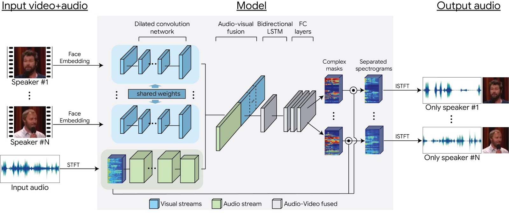

# Looking to Listen at the Cocktail Party

## Overview
We are trying to make the network called "[Looking to Listen at the Cocktail Party](https://arxiv.org/abs/1804.03619)",
which is developed by Google. Regardless of speekers, this network can isolate speeches from mixtures of sounds.
Its results are better than any state-of-the-art methods with audio only data because of using both of audio and visual data.

Points to be improved are:

* GPU calculation
* plural batch size
* research of Bi-LSTM layer
* separating mixtures of 3 or more speeches
* output shape

If you have some opinions or advices, let me know. We will be waiting for them.

## Description
This neural network is trained with visual and audio data. Model diagram is as shown below.

First there are audio stream and visual streams. These streams have some dilated convolution layers,
and then there are created the concatenating layer followed by Bi-directionalLSTM layer and 3 fully connected layers.
